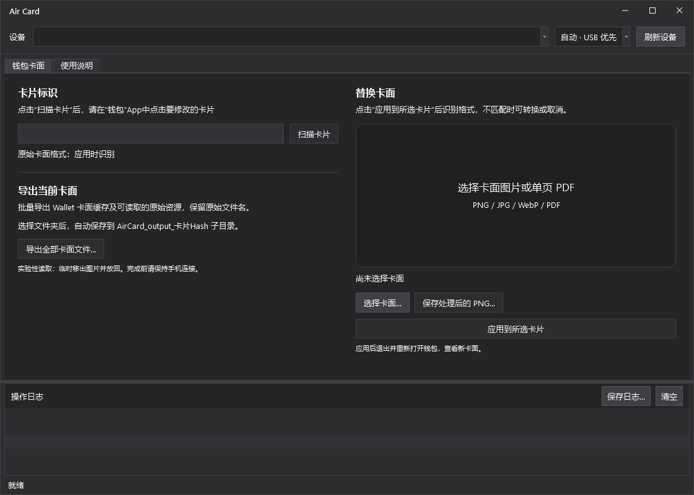

# Air Card

用于 Windows 的 iPhone 钱包卡面工具，基于 C#、WPF 和 .NET Framework 4.7.2。



## 功能

- 扫描钱包中打开的卡片，识别到第一张后自动停止。
- 从卡片目录或 manifest.json 发现图片资源，批量导出设备文件和 Wallet 显示缓存；支持按需下载 .urls 索引中的 Apple 原图并校验大小、SHA-1。
- 导入 PNG、JPG、WebP、未加密的单页 PDF，预览处理后的卡面。
- 点击应用后识别卡面格式；不匹配时询问转换或取消。
- 检查 Apple 设备驱动和 CoreFP 同步组件，缺失时引导下载完整 iTunes。
- 可选采集导出期间的手机同步日志，帮助排查同步握手失败。
- 使用 dnSpy 派生的深色 WPF 主题。
- 投稿卡面：填写 GitHub 表单并上传附件，维护者审核后自动加入 `cards` 分支，下载地址自动生成。见[投稿说明](docs/CARD_SUBMISSIONS.md)。
- 在“卡面库”Tab 内搜索、预览已审核的卡面，并下载原始 PNG/JPG/PDF 文件；无需连接 iPhone。

这是实验性设备读写工具。读取使用 Apple 图书同步通道临时移动资源并归位，操作期间请保持手机连接、解锁。不同 iOS 版本和卡片资源的兼容性存在差异；不能保证所有卡面都能读取或替换。具体机制和限制见 [技术说明](docs/TECHNICAL.md)。

## 环境要求

- Windows 10 或更新版本，64 位。
- .NET Framework 4.7.2 或更新版本。
- Apple 官方完整 64 位桌面版 iTunes，提供设备驱动和 CoreFP 同步组件。首次通过 USB 连接时，需要在 iPhone 上信任此电脑。

环境提示仅提供“下载完整 iTunes”和“取消”。点击下载会打开 [Apple 官方 64 位下载地址](https://www.apple.com/itunes/download/win64)，请自行完成安装或修复，然后重新启动 Air Card。程序不再提供仅安装驱动的脚本。能够连接手机并不代表同步组件完整；缺少可加载的 CoreFP 时不会开始卡面读写。

## 使用

1. 启动 `bin/Release/AirCard.exe`，连接并解锁 iPhone，点击“刷新设备”。
2. 点击“扫描卡片”，然后在 iPhone 的“钱包”App 中打开目标卡片。
3. **导出**：点击“导出全部卡面文件”，等待读取资源清单，再勾选缓存、设备资源或 Apple 原图，选择目标文件夹。远程原图默认不选，勾选后才联网下载，大小及 SHA-1 校验通过后保存。同名设备副本与远程原图同时勾选时保存 Apple 原图。结果保存在 `AirCard_output_<卡片Hash>` 子目录，保留原始文件名和子目录；缓存另存为 `Wallet 卡面缓存.png` 或 `.jpg`。未读取到的设备资源正常跳过。启用诊断日志时先选择文件夹，以便记录清单读取阶段。
4. **替换**：选择本地图片或 PDF。选择文件只加载预览；点击“应用到所选卡片”后才识别设备上的原始格式，不匹配时选择转换或取消。
5. 如果同一组主卡面同时包含 PNG 和 PDF，先选择要覆盖的格式。程序无法仅凭文件存在判断钱包实际使用哪一种，不会自动按导入格式写入。

“卡面库”Tab 在打开时从 `cards` 分支读取公开索引。选择卡面会下载并校验原文件，在软件中显示预览；默认按 3.18 mm 圆角预览，可取消勾选“显示圆角预览”查看矩形原图，下载文件不受此选项影响。点击“立即使用”会把原文件保存到本地 `CardLibraryCache`，载入“钱包卡面”Tab 并跳转；这一步不会写入手机。也可点击“下载原文件”选择保存位置。刷新按钮可重新读取索引；投稿按钮会打开 GitHub 表单。索引为空时显示“暂无已收录卡面”。

PNG 输出居中裁切为 **1536 × 969**；图片转 PDF 后仍是位图内容。PDF 转 PNG 会栅格化；导入 PDF 并以 PDF 应用时保留原文件字节。PDF 仅支持未加密单页文件，大小不超过 32 MB。WebP 需要系统可用的解码器。

导出列表分为“本地文件”和“在线文件”，Wallet 缓存列在本地文件中。设备可能不允许直接列举卡片目录，此时从 `manifest.json` 和 `.urls` 发现实际图片名称。清单不保证包含后续添加的文件；远程索引与本地副本可以同时存在。设备副本表示尝试读取，不能保证手机当前保存了该文件。`.urls` 仅用于内部解析，不显示为导出项，也不保存到导出文件夹。仅支持索引中带大小和 SHA-1 的 Apple HTTPS 图片地址；无可用清单时仍可导出 Wallet 缓存。

应用结束后退出并重新打开钱包查看结果。扫描标识只在重新扫描或刷新设备时清空，不保存扫描历史。WiFi 模式需要先通过 USB 配对并启用 WiFi 同步。

重试或重启程序不再自动接续历史未完成操作。本次操作中的归位和延迟文件检查仍会执行；历史操作记录及备份保留。若程序中断时原文件未归位，重启不会自动替它归位。

导出或应用期间可点击“取消操作”。界面立即响应，停止后续资源读写；正在进行的原生同步、当前资源归位及同步清理须完成后才退出，无法保证即时中断 Apple 驱动调用。已经完成的导出文件和写入修改保留，不自动撤销。

## 构建

安装 Visual Studio 2022 或 Build Tools，并包含：

- .NET 桌面开发工具。
- .NET Framework 4.7.2 Targeting Pack。
- Windows 10/11 SDK（PDF 渲染所需的 WinRT 引用）。

在 Windows PowerShell 中运行：

```powershell
.\Build.ps1
```

也可打开 `AirCard.sln`，选择 `Release | x64`。构建结果位于 `bin/Release`；源码仓库不提交程序二进制、Apple 驱动或本地设备数据。

若使用独立的 .NET 参考程序集目录，可指定：

```powershell
.\Build.ps1 -ReferenceAssemblies 'D:\ReferenceAssemblies\v4.7.2'
```

## 测试

```powershell
# 离线测试：不会连接手机、弹出 UAC 或安装驱动
.\Tests\Run.ps1 -Artifacts "$env:TEMP\AirCard-tests"

# 额外检查已安装的 Apple 原生接口；仍不会操作手机
.\Tests\Run.ps1 -Artifacts "$env:TEMP\AirCard-tests" -NativeBindings
```

测试涵盖卡面处理、资源读写流程、同步诊断、环境提示和界面行为；可选原生检查验证已安装的 Apple 接口及组件加载。离线检查不代表所有设备和卡片的真机兼容性，故障设备补齐 CoreFP 后仍需验证。

## 源码结构

| 路径 | 用途 |
| --- | --- |
| `MainWindow.xaml`、`MainWindow.xaml.cs` | 主界面与操作流程 |
| `Core/` | 设备通信、卡片扫描、卡面处理和读写事务 |
| `Controls/`、`Themes/` | WPF 控件与主题 |
| `Tests/` | 离线回归测试和可选的原生接口检查 |
| `ThirdParty/` | 上游源码、固定版本和授权说明 |
| `docs/` | 机制、限制和界面截图 |

## 来源与授权

本组合版本按 **GPL-3.0-or-later** 提供，见 [LICENSE.txt](LICENSE.txt)。原始授权与来源说明保留在 [ThirdParty](ThirdParty)。

- [Lumid-Off/AirCard-Windows](https://github.com/Lumid-Off/AirCard-Windows)：设备引擎移植基线，MIT。
- [0xjohnnydev/airlift](https://github.com/0xjohnnydev/airlift)：间接读取参考，MIT。
- [dnSpy/dnSpy](https://github.com/dnSpy/dnSpy)：主题和控件，经 ConnectDeveloperTool 适配，GPL-3.0-or-later。

Apple 和 iTunes 是各自权利人的商标。本项目与 Apple 无隶属关系。
